# XII Desafio | AWS_FULLSTACK_FEV24 - Projeto MyRide
 

Este é o repositório do projeto "12º Desafio | AWS_FULLSTACK_FEV24" desenvolvido como parte do estágio na Compass UOL. Abaixo estão as informações importantes para o desenvolvimento, entrega e funcionalidades do projeto.

<details>
  <summary style="position:relative;">Como rodar projeto </summary>

## Como instalar as dependências:

```sh
git clone https://github.com/EduardoMG12/Challenge-XII-Frontend---Charles-Eduardo.git
git clone git@github.com:EduardoMG12/Challenge-XII-Frontend---Charles-Eduardo.git # caso estiver usando token ssh use este comando
cd Challenge-XII-Frontend---Charles-Eduardo
bun install

```

## environments

```ts
    VITE_IPGEOLOCATION_API_KEY=30663ed46de6401d8995887e433cde98
    VITE_API_LINK=http://localhost:3000
    VITE_API_COUNTRIES=https://countriesnow.space/api/v0.1/countries
    VITE_API_IPGEOLOCATION=https://api.ipgeolocation.io/ipgeo
```

## Como rodar o projeto
```sh
bun run dev # certifique-se que vocë esta na pasta do projeto
```

</details>

<details>
  <summary style="position:relative;">Algumas imagens o projeto </summary>
  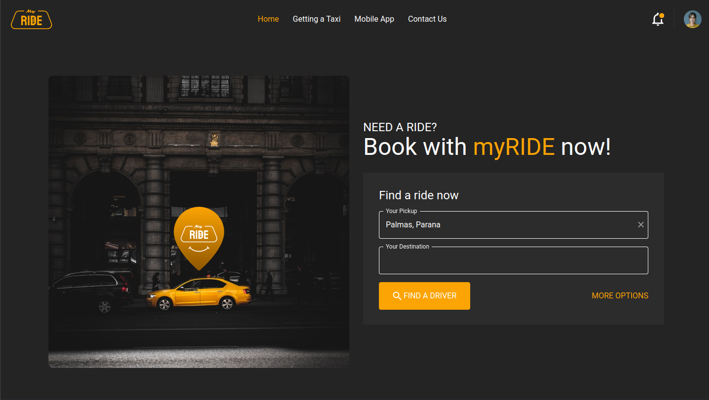
  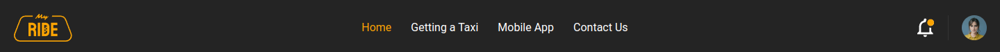
  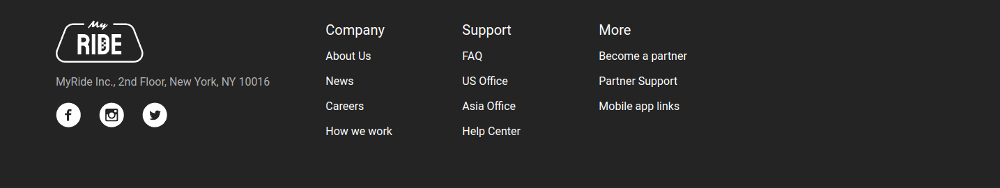
  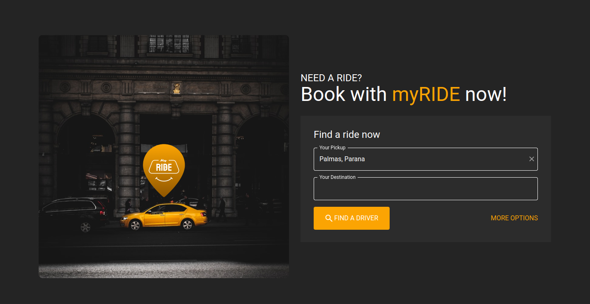
  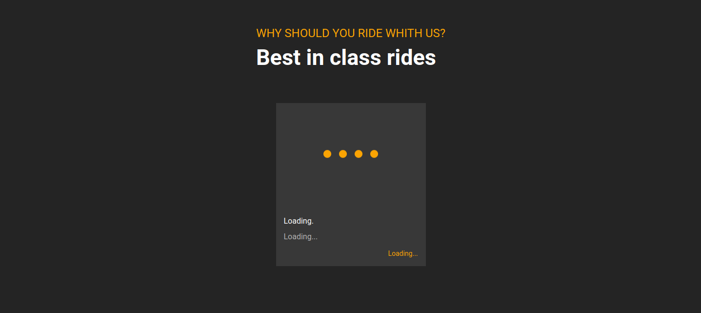
  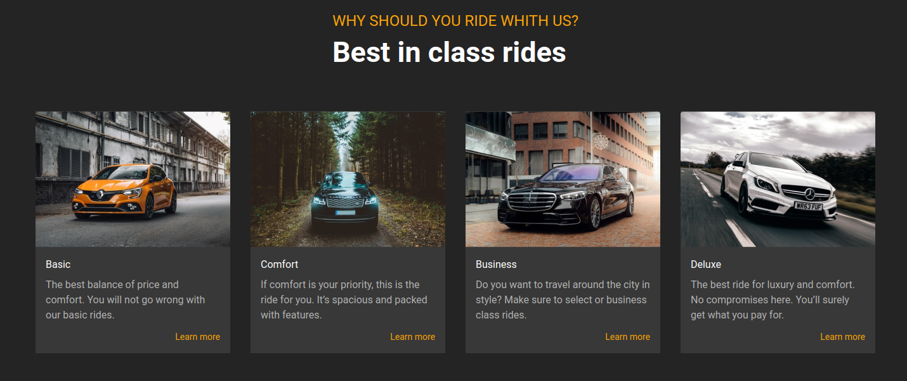
  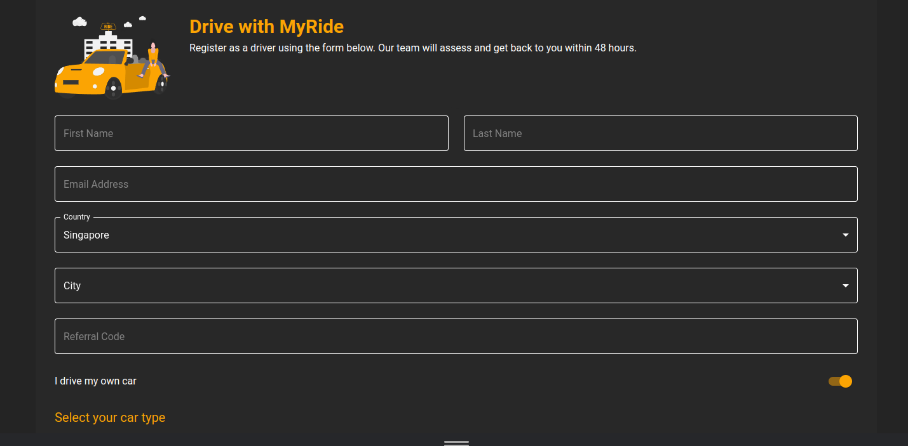
  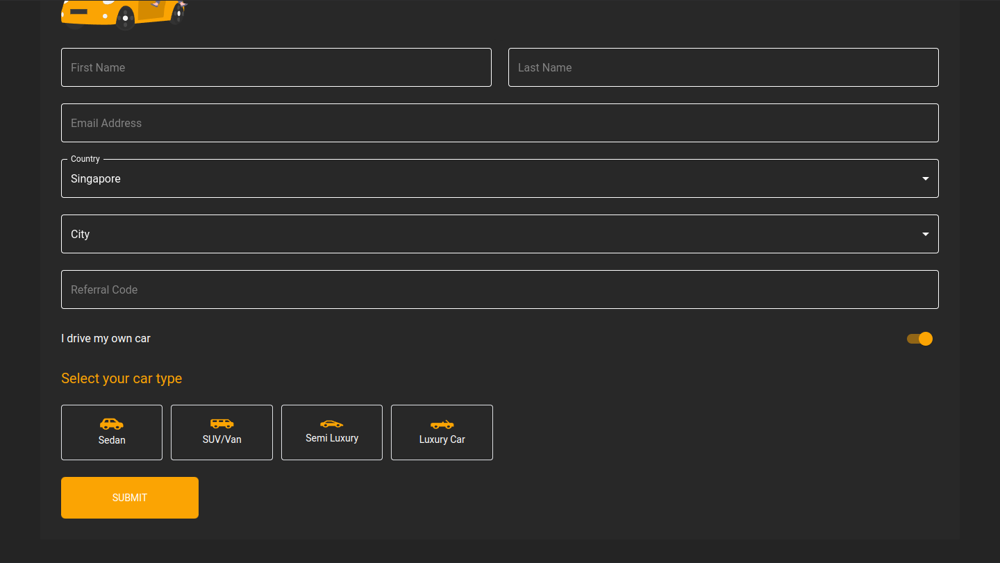

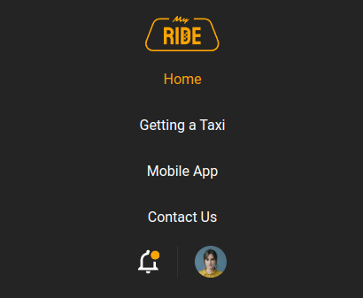
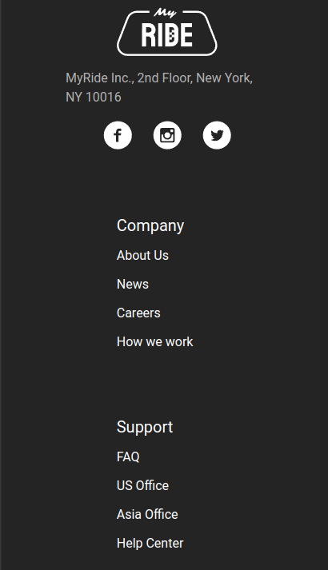
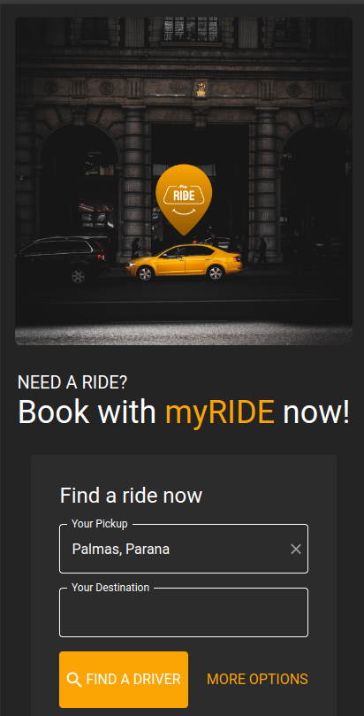
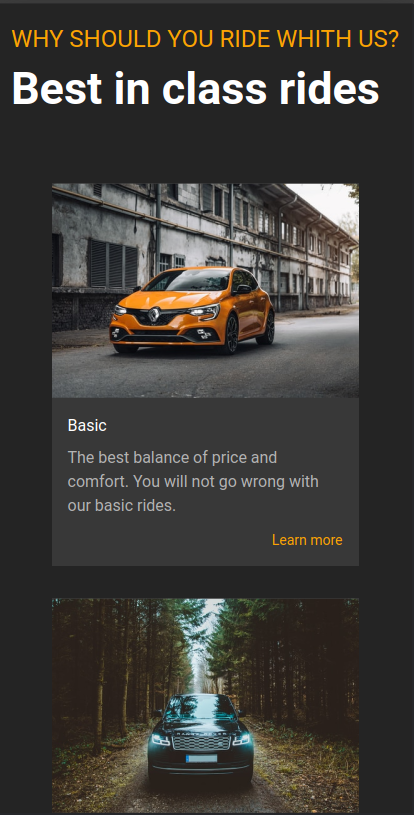
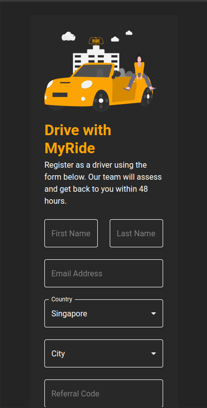

</details>

<details>
  <summary style="position:relative;">Sobre o desenvolvimento </summary>

## Sobre o desenvolvimento

### Desenvolvedor: 

- [**Charles Eduardo**](https://github.com/EduardoMG12)

### Trello:
[Trello](https://trello.com/c/W1atWg1P)

### Descrição técninca

O projeto foi desenvolvido seguindo a arquitetura padrão do React. Para garantir a qualidade e a consistência do código, adotei o ESLint e o Prettier. Além disso, componentizei tudo que achei necessario na aplicação para o codigo ficar mais legivel e bem organizado segui a convenção de Conventional Commits para os commits.

Optei por priorizar o código e os comentários em inglês, alinhando-se com as práticas padrão da indústria. Para a estilização da aplicação utilizei o TailWindCSS e o MUI, para o roteamento optei por usar o react-router-dom, para a criação do formulário validação do seus dados e envio do formulário utilizei o react-hook-form, zod e o axios.

### Superando Obstáculos

O desenvolvimento do projeto apresentou um desafio principail:

- 1. O envio do formulário:

    A implementação do formulário e suas validações, juntamente com o uso do hookForm, foram o que me exigiram dedicação total.
    Manter um alto padrão de qualidade no código foi uma meta constante, e a implementação do backend, que inicialmente parecia ser um grande obstáculo, acabou sendo uma tarefa mais simples do que o esperado.
    Este projeto para mim representou mais do que um desafio técnico. Foi uma oportunidade pela qual estava esperando e sou extremamente grato. 
    No final, estou orgulhoso do trabalho realizado e acredito que consegui entregar um projeto que reflete todo o meu esforço e dedicação.

### Diferenciais do projeto

#### Acessibilidade
    Visei a acessibilidade em todas as partes do projeto. Isso inclui a adição de atributos alt em todas as imagens, garantindo que o conteúdo seja acessível para todos os usuários.

#### Otimização de Requests
    Para economizar requests, utilizei o armazenamento do IP e a localização do usuário no localStorage. Isso reduz a necessidade de requests repetidas, melhorando a eficiência e a velocidade do nosso aplicativo. Além disso, implementamos uma lógica própria para que, quando o usuário acessa o site de uma região diferente, o localStorage seja automaticamente resetado e uma nova request seja feita. Isso garante que as informações de localização estejam sempre atualizadas.

#### Padronização do Código
    Mantive um alto padrão de qualidade no código, com todo o código sendo escrito em inglês. Isso facilita a leitura e a compreensão do código por desenvolvedores de todo o mundo.

### Responsividade
    O projeto é totalmente responsivo, garantindo uma experiência de usuário consistente em todos os dispositivos e tamanhos de tela.

#### Uso de Suspense e Lazy
    Utilizei Suspense e lazy no arquivo app.tsx. Isso ajuda no carregamento de cada página e garante que apenas os componentes necessários sejam carregados no navegador do usuário. Isso melhora a eficiência e a velocidade da aplicação.

</details>

## Sobre o projeto.

### Descrição.

O projeto consistia na criação de uma aplicação react com o uso de demais bibilhotecas sendo totalmente opcional, a aplicação consistia em um frontend de um página com um header e footer estático, uma home com 3 sessões a primeira sessão consistia em pegar dados do usuário e assim fazer uma requisição a uma api buscando sua localização, a segunda sessão consistia em 4 cards com dados do backend e a terceira sessão tinha como objetivo fazer um formulário com validações que enviaria dados ao backend

um frontend de motoristas similar ao uber, o projeto obrigatoriamente deve seguir esses requisitos:
- Fazer o site com React e typescript (qualquer framework e biblioteca é permitido).
- As imagens consumidas pelo frontend devem estar upadas no Amazon S3.  
- Seguir layout do figma.
- Fazer responsividade: 1440px e 414px.
- Header estático.
- Footer estático.
- Criar página 404.
- Página 404 - usar o fundo preto do layout e com um ícone de atenção redondo na cor amarela
- Links do footer levar a página 404 (colocar um link e ele ser redirecionado para a página 404)
- Links das redes socias devem levar para as redes sociais da Compass

 O Projeto deve seguir as especificações do [Notion](https://best-dryer-b6f.notion.site/Desafio-Semana-XII-8fad36f2de0e407dba9868496c23777a), com atenção especial ao prazo e os requisitos obrigatorios do projeto.

### *Instrutores*
- **Rafaela Janeczko:** [rafaela.janeczko@compasso.com.br](mailto:rafaela.janeczko@compasso.com.br)
- **Maithe Saldanha Ferrao:** [maithe.ferrao@compasso.com.br](mailto:maithe.ferrao@compasso.com.br)
- **Cassio Silva Takarada:** [cassio.takarada@compasso.com.br](mailto:cassio.takarada@compasso.com.br)
- **Leonardo Buhring Muller:** [l.muller.dev@gmail.com](mailto:l.muller.dev@gmail.com)
- **Gabriel Bezerra Rodrigues:** [gabriel.bezerra@compasso.com.br](mailto:gabriel.bezerra@compasso.com.br)
- **Anthoni Bortolotto Martinelli:** [anthoni.martinelli@compasso.com.br](mailto:anthoni.martinelli@compasso.com.br)

### **Prazo**

Prazo para **envio** do e-mail com **link do repositório:** 09/05/2024  (quinta-feira), **até às 17h30**.

Prazo máximo para **envio** do ultimo commit no repositório: Último commit até às 17h30 de 21/05/2024 (terça-feira).

